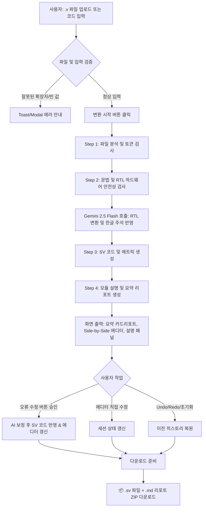

# [PRD] Verilog to SystemVerilog 변환 및 RTL 업무 자동화 웹앱

## 1. 개요 (Overview)

### 1.1 제품 목적 (Product Purpose)
* Verilog(`.v`) 코드를 표준 SystemVerilog(`.sv`) 코드로 자동 변환하고, 코드 설명 및 한글 주석, 문법 오류 자동 수정 기능을 제공합니다.
* 반복적인 RTL 변환 및 검수 업무를 자동화하여 엔지니어의 실수를 줄이고, 비개발자(또는 초급 엔지니어)도 손쉽게 사용할 수 있도록 보조합니다.

### 1.2 핵심 기술 제약 (Technical Constraints)
* **프레임워크:** Python 기반 Streamlit 웹 애플리케이션 (배포 용이성 고려)
* **LLM Engine:** Google Gemini API (`gemini-2.5-flash` 모델)
* **보안 및 키 관리:** Gemini API 키는 Streamlit Secrets (`.streamlit/secrets.toml`)로 관리하며, `.gitignore`를 통해 GitHub에 노출되는 것을 엄격히 금지
* **Testbench 실행 범위:** 웹앱 내에서는 Testbench를 직접 실행(Simulation)하지 않음 (코드 생성 및 다운로드까지만 지원)
* **RTL 처리 가이드라인 준수:** `@RTL_GUIDELINES.md`의 변환 규칙을 프롬프트 및 처리 로직에 엄격히 적용

---

## 2. RTL 처리 및 변환 원칙 (RTL Principles)

`gemini-2.5-flash` 모델 프롬프트 및 변환 파이프라인 구축 시 아래 원칙을 **절대적인 제약사항(System Prompt)**으로 포함합니다.

1. **기능 및 동작 보존:** 원본 RTL의 기능, 신호명, 비트 폭, 조건문, 상태 전이, Reset 방식을 임의로 변경하거나 추측하여 추가하지 않음.
2. **구문 및 스타일 구체화:**
   * `reg` / `wire` 구분을 `logic`으로 일괄 통일
   * `always` 블록을 동작(클록, 조합 회로, 래치)에 따라 `always_ff`, `always_comb`, `always_latch`로 명확히 분리
   * 포트 선언 방식을 ANSI 스타일 표준으로 정돈
3. **Hardware-Safety 검증:**
   * 의도하지 않은 Latch 발생 방지 (조합 회로 내 완전한 `if-else` 및 `default` 처리)
   * Multi-driven bus 발생 방지 및 Unknown(`X`) 값 전파 방지
   * Blocking(`=`) / Non-blocking(`<=`) 할당 구문의 정확한 구분 사용
4. **Reset 처리 규칙:** Reset이 `negedge`인지 `posedge`인지 정해지지 않았다면 기본적으로 **`negedge` (Active-Low)**로 처리.
5. **주석 및 설명:** 변환된 SystemVerilog 코드 기준으로 정확한 라인 위치에 한글 주석을 생성.

---

## 3. 사용자 및 사용 시나리오 (User Scenario)

1. **입력:** 사용자가 `.v` 파일을 드래그 앤 드롭하거나 텍스트 에디터에 직접 코드를 붙여넣음.
2. **옵션 설정:** 상단에서 `한글 주석 생성 (ON/OFF)` 토글 스위치 설정 및 에디터 폰트 크기 선택.
3. **변환 요청:** [SystemVerilog로 변환] 버튼 클릭.
4. **진행 상황 확인:** 4단계 Progress Bar를 통해 진행률 실시간 파악.
5. **결과 확인 및 분석:**
   * 메인 상단의 **요약 카드 리포트**를 통해 변환 결과 요약 확인.
   * **Side-by-Side 에디터**에서 원본과 변환 결과를 비교 (변경 구문 하이라이트 표시).
   * **오류 검사 패널**에서 감지된 원본 문법 오류 확인 후 [자동 수정] 승인 적용.
   * **코드 설명 패널**에서 전체 모듈 동작 및 구조 이해.
6. **편집 및 다운로드:** 변환 결과물(`.sv`)을 에디터에서 직접 수정한 뒤, 설명 리포트와 함께 ZIP 파일로 전체 다운로드.

---

## 4. 상세 기능 요구사항 (Functional Requirements)

### 4.1 입력 및 제어 (Input & Control)
* **파일 업로드 / 직접 입력 Dual 지원:**
  * `.v` 파일 드래그 앤 드롭 (Streamlit `st.file_uploader`)
  * 텍스트 에디터 직접 입력/붙여넣기 지원 (Streamlit `st.text_area` 또는 에디터 컴포넌트)
* **옵션 및 가시성 제어:**
  * **한글 주석 토글 (ON/OFF):** ON일 경우 코드 라인별 한글 주석 생성 (`// ...`)
  * **폰트 크기 조절기:** Small / Medium / Large (에디터 가독성 향상)
  * **전체 초기화 버튼:** 입력된 코드, 업로드 파일, 변환 세션 상태 전체 리셋
  * **Undo / Redo (히스토리 복원):** 직전 변환 또는 자동 수정 전 상태로 되돌리기 기능 제공

### 4.2 메인 요약 리포트 (Summary Dashboard)
웹앱 메인 최상단에 카드 형태로 한눈에 파악할 수 있는 메트릭 배치 (Streamlit `st.metric`)
* **모듈 정보 카드:** 모듈명, 포트 수(Input/Output)
* **변환 통계 카드:** 변환된 라인 수, `logic` 변환 수, `always_ff/comb` 전환 건수
* **오류 리포트 카드:** 원본 코드 구문 오류 감지 건수, 자동 수정 적용 여부

### 4.3 비교 에디터 (Side-by-Side Comparison)
* **좌측 (Verilog 원본):**
  * 원본 코드 표시, 줄 번호(Line Number), 구문 하이라이팅
  * 1클립보드 복사 버튼
* **우측 (SystemVerilog 결과):**
  * 변환 결과 코드 표시, 변경된 구문/라인 하이라이트 또는 볼드 강조
  * **결과 코드 직접 수정 가능 (Editable Editor):** 사용자가 다운로드 전 최종 코드 직접 수정
  * 1클립보드 복사 버튼

### 4.4 코드 설명 및 오류 수정 패널 (Analysis & Fix)
* **코드 설명 패널 (Code Explanation):**
  * 변환된 SystemVerilog 모듈 구조, 입출력 신호 역할, FSM/조합회로 동작 원리를 요약 설명
* **오류 검사 및 자동 수정 패널 (Error Analysis & Fix):**
  * 원본 Verilog 문법 오류, 미선언 신호, Latch 위험 구문 탐지 시 오류 위치(Line)와 이유 안내
  * **[자동 수정 승인] 버튼:** 클릭 시 Gemini API를 통해 문법 오류 보정 및 재변환 진행

### 4.5 변환 결과물 전체 다운로드 (Download)
* 다운로드 클릭 시 다음 2개 파일을 포함하는 `.zip` 파일 생성 및 저장:
  1. `[module_name].sv`: 변환/수정 완료된 SystemVerilog 파일
  2. `[module_name]_report.md`: 모듈 요약 리포트, 코드 설명, 오류 수정 내역

---

## 5. UI/UX 및 화면 구성 (UI Layout Plan)

```text
+-----------------------------------------------------------------------------------+
|  [Header] RTL Verilog → SystemVerilog Converter                                   |
|  [Options] [한글 주석: ON/OFF]  [폰트 크기: Medium ▾]  [↺ 전체 초기화]             |
+-----------------------------------------------------------------------------------+
|  [Summary Cards]                                                                  |
|  +------------------+  +------------------+  +---------------------------------+  |
|  | 모듈명: top_fsm  |  | logic 변환: 14건  |  | 구문 오류: 1건 (자동수정 대기) |  |
|  +------------------+  +------------------+  +---------------------------------+  |
+-----------------------------------------------------------------------------------+
|  [Progress Bar] ██████████████████████████ 100% (4. 리포트 생성 완료)             |
+-----------------------------------------------------------------------------------+
|  [Main Editor - Side by Side]                                                     |
|  +-----------------------------------+  +--------------------------------------+  |
|  | Verilog (원본)             [📋]   |  | SystemVerilog (결과-수정가능)  [📋]  |  |
|  | --------------------------------- |  | ------------------------------------ |  |
|  | 1  module top (clk, reset, d, q); |  | 1  module top (                      |  |
|  | 2    input clk, reset;            |  | 2    input  logic clk, reset,        |  |
|  | 3    reg q;                       |  | 3    output logic q                  |  |
|  | ...                               |  | ); ...                               |  |
|  +-----------------------------------+  +--------------------------------------+  |
|  [Undo] [Redo]                                                                    |
+-----------------------------------------------------------------------------------+
|  [Tabs or Expander: Detail Analysis]                                              |
|  +-----------------------------------------------------------------------------+  |
|  | [Tab 1: 📝 모듈 동작 설명]   |   [Tab 2: ⚠️ 오류 검사 및 자동 수정]            |  |
|  | - 전체 모듈 동작 구조 요약     | - Line 12: ';' 누락 감지                    |  |
|  | - 입출력 인터페이스 제어 방식  | - [ 🪄 오류 자동 수정 승인 및 재변환 ]     |  |
|  +-----------------------------------------------------------------------------+  |
+-----------------------------------------------------------------------------------+
|  [Download Area]                                                                  |
|  [ 📦 변환 결과물 전체 다운로드 (.zip) ]                                          |
+-----------------------------------------------------------------------------------+
```

---

## 6. 시스템 프로세스 흐름 (System Flow)



---

## 7. 오류 처리 및 예외 상황 대응 (Error Handling)

1. **잘못된 파일 확장자 업로드:**
   * `.v` 이외의 확장자(예: `.txt`, `.docx`)가 들어올 경우 `st.error` 또는 Toast 팝업으로 비개발자도 이해하기 쉬운 안내문 출력.
2. **LLM API 호출 실패 / Timeout:**
   * Streamlit Secrets에 API 키 미설정 시: *"Gemini API 키 설정이 필요합니다. 관리자에게 문의하세요."* 경고 표시.
   * API 응답 지연/오류 발생 시: 재시도 버튼 안내 및 진행 중인 Session State 유지.
3. **비정상/불완전 Verilog 구문 입력:**
   * 파싱 불가능 수준의 코드 입력 시, 무작정 변환을 강행하지 않고 [오류 검사 패널]에 감지된 오류 라인과 원인을 우선 출력한 후 [자동 수정 승인] 유도.
4. **대용량 코드 입력:**
   * 단일 파일 크기 한도 안내 및 파이프라인 타임아웃 방지를 위한 예외 처리구문 추가.

---

## 8. 개발 환경 및 보안 요구사항 (Security & Deployment)

1. **Secrets Management:**
   * Gemini API 키는 프로젝트 루트의 `.streamlit/secrets.toml`에 아래와 같이 등록:
     ```toml
     GEMINI_API_KEY = "your_gemini_api_key_here"
     ```
   * `.gitignore` 파일에 `.streamlit/secrets.toml` 및 Python 파이코드/임시 저장소를 반드시 추가하여 GitHub에 유출 방지.
2. **Streamlit 배포 고려사항:**
   * `requirements.txt`에 필요한 패키지(`streamlit`, `google-genai`, `zipfile` 등) 정의.
   * Session State (`st.session_state`)를 활성화하여 에디터 편집, Undo/Redo, 옵션변경 시 화면 재로드(Rerun) 시에도 변환 결과 데이터가 유지되도록 설계.

---

## 9. 개발 구현 단계 (Implementation Steps)

### 🟢 1단계: 개발 환경 구성 및 보안 설정 (Setup & Security)
* **프로젝트 환경 구축**: Python 가상환경 생성 및 필요 라이브러리(`streamlit`, `google-genai` 등) 설치 후 `requirements.txt` 작성.
* **보안 및 키 관리 (`secrets.toml`)**: `.streamlit/secrets.toml` 파일에 Gemini API 키를 저장하고, `.gitignore`에 등록하여 GitHub 유출 방지.
* **기본 파일 구조 정리**: UI 코드, LLM 파이프라인, 프롬프트 가이드라인(`RTL_GUIDELINES.md`)을 분리하여 관리할 폴더 및 파일 생성.

### 🟢 2단계: 데이터 구조 및 세션 상태(Session State) 설계 (State Management)
* **`st.session_state` 구조화**:
  * 원본 Verilog 코드 및 변환된 SystemVerilog 코드 관리
  * 한글 주석 ON/OFF, 폰트 크기 등 사용자 선택 옵션 유지
  * 진행률(Progress Bar) 상태 및 변환 요약 메트릭(변환 라인 수, logic 변환 건수 등) 저장
* **히스토리 및 Undo / Redo 기능 구현**: 변환 전/후 또는 사용자가 직접 수정한 코드의 이력을 배열/스택 구조로 저장하여 복원 기능 구현.

### 🟢 3단계: 핵심 AI 변환 엔진 및 파이프라인 구축 (AI & Processing Pipeline)
* **시스템 프롬프트(System Prompt) 작성**:
  * `@README.md` 및 `@RTL_GUIDELINES.md` 원칙 준수 (기능 보존, `reg/wire` → `logic` 일괄 변경, `always_ff/comb/latch` 구분, Active-Low Reset 기본 적용 등)
* **4단계 진행 파이프라인 구현**:
  1. **Step 1:** 파일 분석 및 토큰 검사
  2. **Step 2:** 문법 및 RTL 하드웨어 안전성(Latch 방지 등) 검사
  3. **Step 3:** SystemVerilog 코드 생성 및 라인별 한글 주석 반영
  4. **Step 4:** 모듈 요약 리포트, 분석 설명 및 오류 리포트 생성

### 🟢 4단계: UI/UX 및 메인 화면 구현 (UI Layout & Components)
* **상단 헤더 및 옵션 제어바**: 한글 주석 토글(ON/OFF), 폰트 크기 선택, 전체 초기화 버튼 배치.
* **메인 요약 카드리포트 (`st.metric`)**: 모듈명, 포트 수, `logic` 변환 수, 오류 검출 건출 카드 구현.
* **4단계 진행률 표시 바 (`st.progress`)**: 변환 단계(1~4단계)에 맞춰 실시간 상태 업데이트.
* **Side-by-Side 비교 에디터**:
  * **좌측**: 원본 Verilog 코드 (줄 번호 및 코드 복사 기능)
  * **우측**: 변환 결과 SystemVerilog (직접 수정 가능한 에디터 적용)
* **상세 분석 탭 (Tabs)**:
  * **탭 1 (코드 설명)**: 입출력 인터페이스 및 모듈 동작 구조 설명
  * **탭 2 (오류 검사 및 자동 수정)**: 원본 구문 오류 표시 및 `[🪄 오류 자동 수정 승인 및 재변환]` 버튼 제공

### 🟢 5단계: 예외 처리 및 다운로드 기능 구현 (Error Handling & Export)
* **입력 유효성 검사 (Validation)**:
  * `.v` 이외의 확장자 업로드 시 사용자 알림(Toast/Modal) 출력
  * API 키 미설정 또는 네트워크 오류 발생 시 에러 메시지 및 재시도 유도
* **자동 수정 승인(Fix Integration)**: 사용자가 오류 자동 수정을 클릭하면 Gemini가 코드를 보정하고 에디터/세션 데이터를 갱신.
* **ZIP 다운로드 기능**:
  * 변환 완료된 `[module_name].sv` 코드 파일과 `[module_name]_report.md` 리포트 파일을 하나로 묶어 `.zip` 형태 생성 및 다운로드 지원.

### 🟢 6단계: 검증 및 테스트 (Testing & Polish)
* **RTL 변환 검증**: 작성된 프롬프트가 RTL 하드웨어 안전성 규칙(Non-blocking 구문, Latch 방지 등)을 정확히 지키는지 다양한 Verilog 샘플 코드로 검증.
* **사용자 시나리오 테스트**: 파일 입력부터 옵션 조절, 에디터 직접 수정, Undo/Redo, 최종 ZIP 다운로드까지 전체 흐름 점검.

